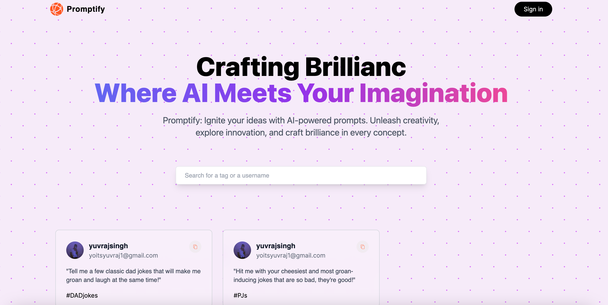

# AI Chatbot Prompt Generator



# Promptify

Welcome to **Promptify**, your platform for generating, storing, and managing creative prompts with ease. Boost your imagination, craft ideas, and explore new horizons through our AI-powered prompt generation. Organize your prompts with tags and search for inspiration whenever you need it.

## Table of Contents

- [About](#about)
- [Features](#features)
- [Technologies Used](#technologies-used)
- [Getting Started](#getting-started)
- [Usage](#usage)
- [Support](#support)
- [Contribute](#contribute)
- [License](#license)

## About

Promptify is a revolutionary platform designed to empower your creativity. It's built to bridge the gap between innovation and inspiration, providing a seamless experience for generating prompts that spark your creative genius. Whether you're a writer, artist, or creator of any kind, Promptify is your go-to source for fresh ideas.

## Features

- **Create and Save Prompts:** Generate prompts tailored to your needs and save them with relevant tags for easy access later.
- **Tag-based Search:** Seamlessly search for prompts based on specific tags to find the inspiration you're looking for.
- **User Accounts:** Create an account to manage your prompts effectively. Keep track of your saved prompts and enhance your creative journey.

## Technologies Used

- **Next.js:** Our website is built using Next.js, a powerful and versatile React framework for server-side rendering and client-side routing.
- **MongoDB:** We use MongoDB to store and manage prompt data efficiently. Organize and retrieve your prompts effortlessly.
- **Tailwind CSS:** Styling is powered by Tailwind CSS, providing a customizable and responsive design that enhances the user experience.
- **Google Authentication:** Securely access your account using Google Authentication, ensuring a smooth and hassle-free login process.

## Getting Started

1. Visit the [Promptify Website](https://get-prompts-three.vercel.app/) to explore and experience creative prompt generation.
2. **Sign Up:** Create an account using Google Authentication.
3. **Create Prompts:** Generate prompts using our AI-powered tool. Add tags to categorize your prompts for easy retrieval.
4. **Search and Explore:** Utilize tag-based search to discover prompts relevant to your interests.
5. **Manage Your Account:** Access and manage your saved prompts, personalizing your creative experience.

## Usage

1. Clone the repository:
   ```
   git clone https://github.com/your-username/your-repo.git
   cd your-repo
   npm install
   npm run dev
   ```
   
## Support

If you encounter any issues or have questions, please reach out to me at my [email](mailto:yuvrajjadon@gmail.com).

## Contribute

We welcome contributions to enhance Promptify's features and usability. Feel free to submit pull requests or issues in our [GitHub repository](https://github.com/yourusername/promptify).

## License

This project is licensed under the [MIT License](LICENSE).

